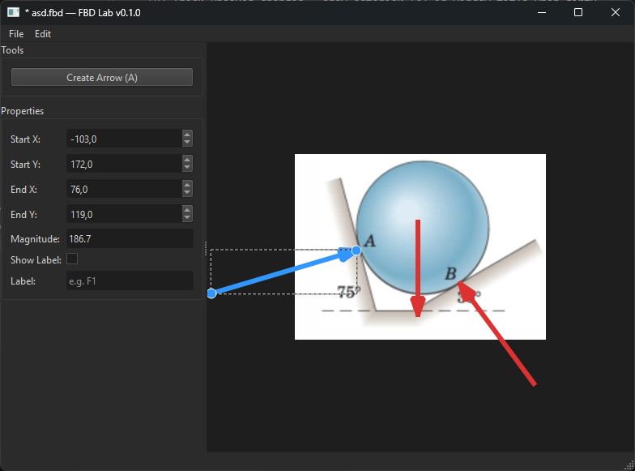

# FBD Lab

A desktop application for drawing **free body diagrams**. Students draw force vectors on a canvas — over a background image of a mechanics problem — and save their work as structured `.fbd` files for grading.



## Features

- **Draw force vectors** — click and drag to create arrows on the canvas
- **Select and edit** — click arrows to select, drag control points to reposition
- **Properties panel** — view start/end coordinates, magnitude, and label
- **Background images** — import via File menu, drag-and-drop, or paste from clipboard
- **Save/Load** — `.fbd` format (JSON with embedded base64 images)
- **Dirty tracking** — unsaved changes shown with `*` in the title bar, with a save prompt on close
- **Dark mode** — Fusion palette for comfortable use

## Quickstart

Requires Python 3.13+ and [uv](https://docs.astral.sh/uv/).

```bash
uv run main.py
```

## Keyboard Shortcuts

| Shortcut | Action |
|---|---|
| `A` | Toggle arrow creation mode |
| `Ctrl+S` | Save |
| `Ctrl+Shift+S` | Save As |
| `Ctrl+O` | Open |
| `Ctrl+N` | New |
| `Ctrl+Q` | Quit |

## File Format

`.fbd` files are human-readable JSON:

```json
{
  "version": 1,
  "background_image": "<base64 or null>",
  "arrows": [
    {
      "tail": [100, 200],
      "head": [250, 150],
      "label_text": "F1",
      "label_visible": true
    }
  ]
}
```

## Grading Workflow

1. Instructor provides a problem image and (optionally) a solution `.fbd`
2. Student opens the image in FBD Lab, draws their free body diagram, and saves
3. The `.fbd` submission is graded — either automatically by comparing vectors against a solution key, or manually by an instructor

## Project Structure

| File | Purpose |
|---|---|
| `main.py` | Entry point, dark palette, signal wiring |
| `canvas.py` | `FBDCanvas` (QGraphicsView) — tools, arrow creation, dragging |
| `arrow_item.py` | `ArrowItem` + `ControlPoint` graphics items |
| `file_io.py` | `.fbd` save/load |
| `ui/mainwindow.ui` | Qt Designer layout with promoted FBDCanvas |
